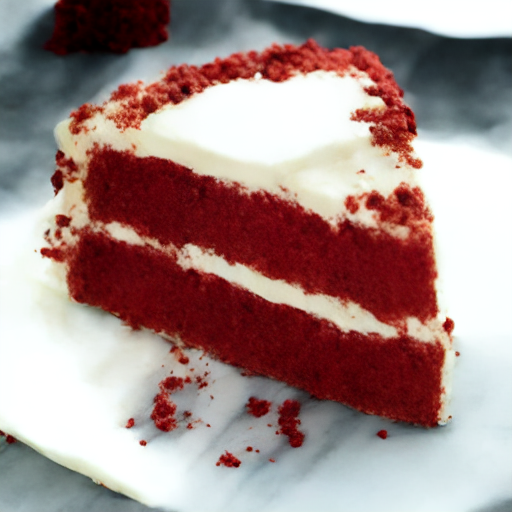

# yuvalalaluf/cross-image-attention Cog model

This is an implementation of [yuvalalaluf/cross-image-attention](https://github.com/camenduru/cross-image-attention-colab) as a [Cog](https://github.com/replicate/cog) model.

## Development

Follow the [model pushing guide](https://replicate.com/docs/guides/push-a-model) to push your own model to [Replicate](https://replicate.com).

## Basic Usage

Run a prediction:

    cog predict -i appearance_img=@red_velvet_cake.jpg -i structure_img=@chocolate_cake.jpg -i domain="cake"

# Example

